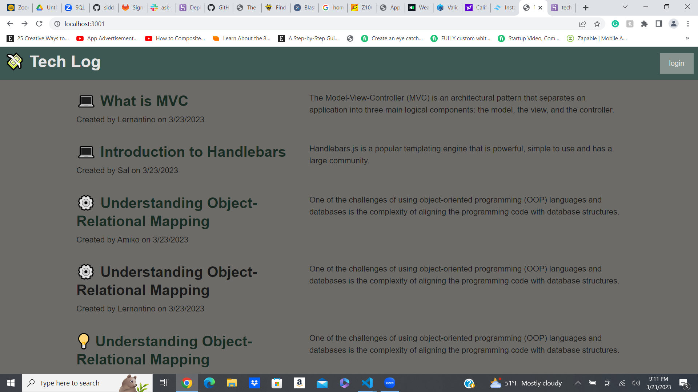

# MVC-Tech-Log

## Description
A CMS-style blog site similar to a Wordpress site, where developers can publish their blog posts and comment on other developers’ posts as well.

## Table of Contents
Installation
Usage
Screenshot
links

## Installation
 [express-handlebars](https://www.npmjs.com/package/express-handlebars) package to implement Handlebars.js for your Views, use the [MySQL2](https://www.npmjs.com/package/mysql2) and [Sequelize](https://www.npmjs.com/package/sequelize) packages to connect to a MySQL database for your Models, and create an Express.js API for your Controllers.

## Screenshot
 

## links
https://techblogss.herokuapp.com/
## github
https://github.com/siddz415/MVC-Tech-Log